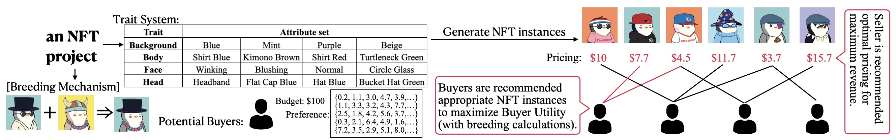

# Equilibrium-Based NFT Marketplace Recommendation for NFTs with Breeding

We develop BANTER (Breeding-aware NFT Equilibrium Recommendation), providing joint recommendation for seller pricing and buyer purchasing for NFT projects with breeding that attains competitive equilibrium.


## usage
0. view full paper with proof at `full_paper.pdf`
1. download the NFT data
```bash
cd NFT_data
bash download.sh
cd ..
```
2. run the experiments (uses `uv` package manager)
```bash
cd src
python main.py
```
## Citation
If you find this work or code is helpful in your research, please cite our work:
```
@inproceedings{yeh2025equilibrium,
  title={Equilibrium-Based NFT Marketplace Recommendation for NFTs with Breeding},
  author={Yeh, Chin-Yuan and Chen, Hsi-Wen and Yang, De-Nian and Lee, Wang-Chien and Yu, Philip S and Chen, Ming-Syan},
  booktitle={2025 IEEE International Conference on Data Mining (ICDM)},
  year={2025},
  organization={IEEE}
}
```