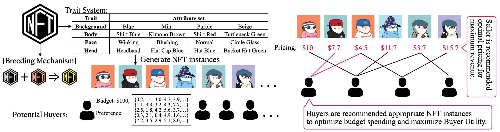

# BANTER
source code for VLDB submission VLDB (track: Research -> April 2024) submission # 25

## Notes
- The long version paper with full theorem proofs can be found in [`doc/full.pdf`](doc/full.pdf)
- Use `getdata.sh` to download the NFT data.
- Code are contained in `/src` directory.  `src/main.py` is the main experiment script.

```bash
bash getdata.sh
cd src
python main.py
```


